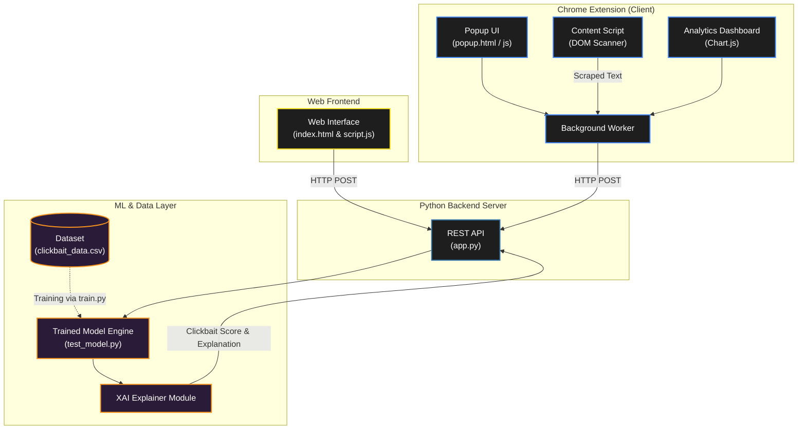

# Explainable Clickbait Detection 🎣🔍

<div align="center">
  <p><b>An Intelligent Browser and Web-Based Clickbait Analysis System</b></p>
  <p><i>Utilizing machine learning to not only detect clickbait headlines but provide transparent, explainable insights into why a headline is manipulative.</i></p>

  [](#)
  [](#)
  [](#)
  [](#)
</div>

<br />

## 📑 Table of Contents
1. [Overview](#-overview)
2. [Key Features](#-key-features)
3. [System Architecture](#-system-architecture)
4. [Tech Stack](#-tech-stack)
5. [Getting Started](#-getting-started)
6. [Project Structure](#-project-structure)
7. [Future Enhancements](#-future-enhancements)

---

## 📖 Overview
The **Explainable Clickbait Detection** system is a multi-platform tool designed to protect users from sensationalist and misleading web content. Unlike standard black-box classifiers, this system emphasizes **Explainable AI (XAI)**, providing users with the exact linguistic triggers and patterns that flagged a headline as clickbait.

The project features a lightweight Python backend for ML inference, a standalone web frontend, and a native Chrome Extension that analyzes web pages in real-time, complete with a built-in analytics dashboard to track your browsing safety.

---

## 🌟 Key Features

* **🧠 Explainable ML Model:** Trained on `clickbait_data.csv`, the model (`train.py`) identifies sensationalist text and highlights the specific words or structural patterns responsible for the classification.
* **🧩 Chrome Extension Integration:** Real-time web scanning. The extension features background processing, content scripts for DOM manipulation, and interactive popups.
* **📊 Analytics Dashboard:** A dedicated analytics view (`analytics.html`, `chart.js`) within the extension to visualize historical clickbait exposure.
* **🌐 Standalone Web Frontend:** A clean, decoupled web interface (`frontend/index.html`) allowing manual input and testing of headlines.
* **📄 Automated Reporting:** Generate comprehensive analysis reports using `generate_report.py` and `create_algorithmic_sdd.py`.

---

## 🏗️ System Architecture



---

## 💻 Tech Stack

### **Machine Learning & Backend**

* **Language:** Python 3.x
* **Server:** Flask / FastAPI (via `app.py`)
* **Data Processing:** Pandas, NumPy (`clickbait_data.csv`)
* **ML Pipeline:** Custom NLP classification algorithms (`model/train.py`)

### **Frontend Interfaces**

* **Chrome Extension:** Manifest V3, Vanilla JavaScript, HTML/CSS
* **Web UI:** HTML5, CSS3 (`style.css`), JavaScript (`script.js`)
* **Data Visualization:** Chart.js

---

## 🚀 Getting Started

Follow these steps to run the detection system locally.

### Prerequisites

* Python 3.8+
* Google Chrome (for the extension)

### 1. Setup the Backend API

1. **Clone the repository & navigate to the project:**
```bash
git clone [https://github.com/your-username/explainable-clickbait-detection.git](https://github.com/your-username/explainable-clickbait-detection.git)
cd explainable-clickbait-detection

```


2. **Install dependencies:**
```bash
pip install -r requirements.txt

```


3. **Start the Python server:**
```bash
cd backend
python app.py

```


*Ensure the server is running on the expected port (e.g., localhost:5000) for the frontend clients to connect.*

### 2. Setup the Chrome Extension

1. Open Google Chrome and navigate to `chrome://extensions/`.
2. Enable **Developer mode** (toggle in the top right).
3. Click **Load unpacked** and select the `extension/` folder from this project.
4. Pin the extension to your toolbar to access the `popup.html` and `analytics.html`.

### 3. Run the Web Frontend

Simply open the standalone web application by double-clicking `frontend/index.html` in your browser, or host it using a simple live server.

---

## 📁 Project Structure

```text
Explainable-Clickbait-Detection/
├── backend/
│   ├── app.py                   # Main API routing and server setup
│   └── __pycache__/             # Compiled Python files
├── extension/                   # Chrome Extension Source
│   ├── manifest.json            # Extension configuration (Manifest V3)
│   ├── background.js            # Service worker for API communication
│   ├── content.js               # Scans DOM for headlines on active tabs
│   ├── popup.html & popup.js    # Quick-access extension interface
│   ├── analytics.html & .js     # Detailed browsing statistics
│   ├── chart.js                 # Charting library for analytics
│   └── style.css                # Extension styling
├── frontend/                    # Standalone Web Application
│   ├── index.html               # Web UI layout
│   ├── script.js                # Frontend API consumption logic
│   └── style.css                # Web UI styling
├── model/
│   └── train.py                 # ML model training and evaluation script
├── clickbait_data.csv           # Main dataset for training/testing
├── test_model.py                # Script to validate model accuracy
├── generate_report.py           # Generates system performance reports
├── create_algorithmic_sdd.py    # Generates software design documentation
├── requirements.txt             # Python backend dependencies
└── README.md

```

---

## 🔮 Future Enhancements

* **Multi-Lingual Support:** Expand the NLP model to detect clickbait patterns in languages other than English.
* **Social Media Integration:** Develop specific content scripts optimized for infinite-scrolling feeds like X (Twitter), Facebook, and Reddit.
* **Crowdsourced Feedback:** Add a feature in the Chrome extension popup allowing users to report false positives/negatives, continuously improving the dataset.

---
